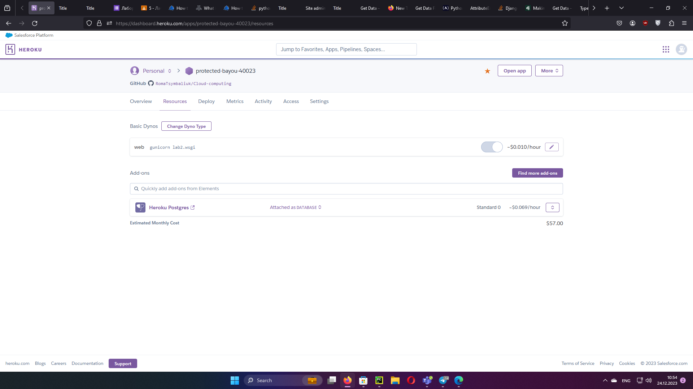
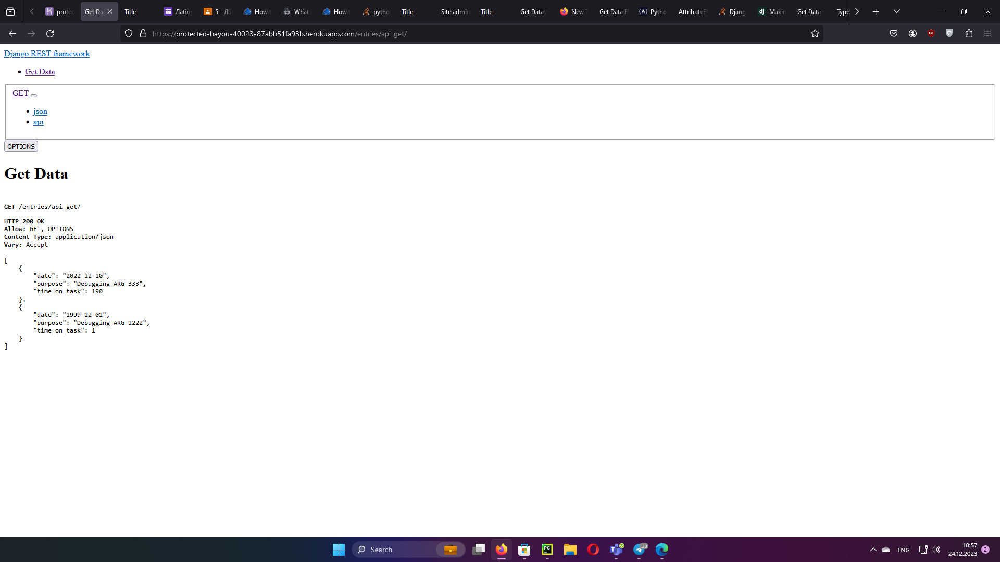
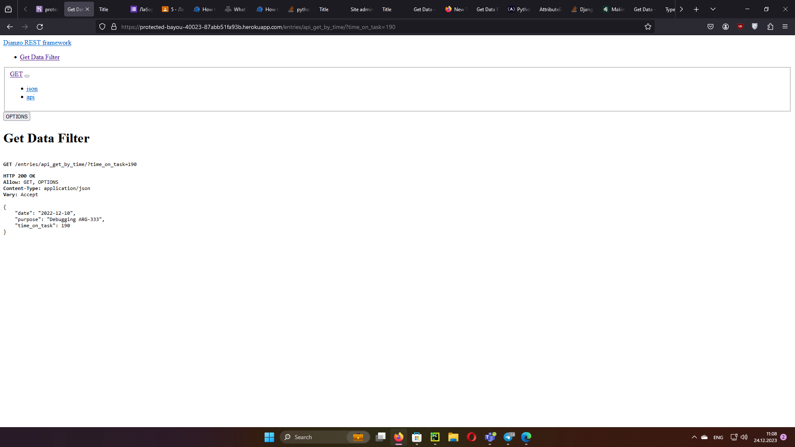

# Lab 1

Created hello-world application. Added app to the heroku.

# Lab 2

Created task time tracking system with CRUD operations. User can add time entry, delete time entry, update time
entry.

Time entry form:

Result:

Deletion of the time entry:

Updating time entry:

# Lab 3

Investigated quotas cloud platform Heroku. Investigated limits of heroku

# Lab 4

Connected application to the postgreSQL. Set DATABASE_URL variable to DATABASE_URL='postgres://u4uj5nffopolmv:pcc5e1639eb680d1cf47598ca320bee3917fa332822c7d774e898d8947c44442b@ec2-34-197-29-232.compute-1.amazonaws.com:5432/d38pa1b0lgq4h1'

PostgreSQL connection on the heroku account:

Also resources and memory that was used can be found on https://data.heroku.com/datastores/acfd032c-18ac-42b9-a78c-273f70670d27

# Lab 5

Created RESTfull HTTP API with Django REST Framework. Functions that are available via API:

1. https://protected-bayou-40023-87abb51fa93b.herokuapp.com/entries/api_get/ - Returns all time entries:

2. https://protected-bayou-40023-87abb51fa93b.herokuapp.com/entries/api_post/ - Add time entry via POST request:

Working on POST request. Locally works fine. Doesn't work on heroku.

3. https://protected-bayou-40023-87abb51fa93b.herokuapp.com/entries/api_get_by_time/?time_on_task=<time_on_task>

Get entry by time_on_task param

For example: https://protected-bayou-40023-87abb51fa93b.herokuapp.com/entries/api_get_by_time/?time_on_task=190 returns:

4. https://protected-bayou-40023-87abb51fa93b.herokuapp.com/entries/api_get_by_purpose/?purpose=<purpose>

Get entry by purpose param

For example: https://protected-bayou-40023-87abb51fa93b.herokuapp.com/entries/api_get_by_time/?time_on_task=190 returns:

